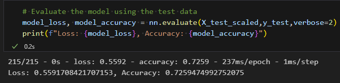
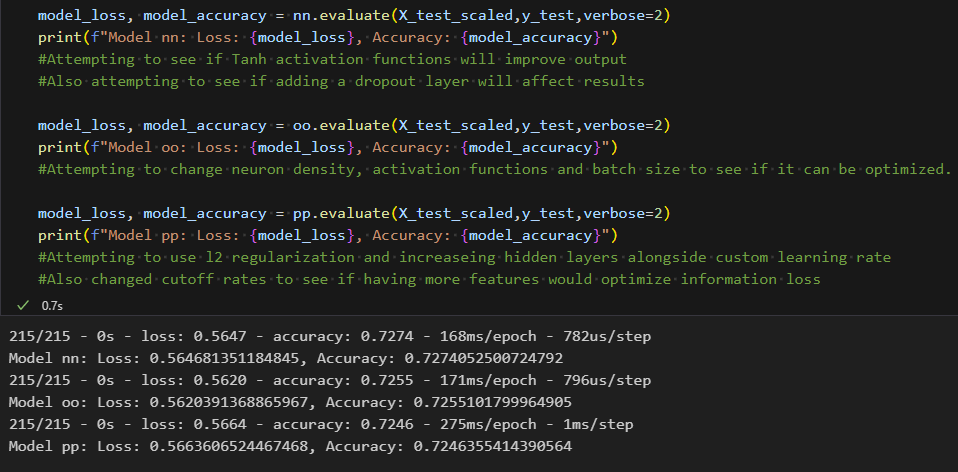

## Overview of the Analysis

The purpose of this analysis was to create deep learning models for Alphabet Soup, a nonprofit foundation, to predict the effectiveness of funding for different organizations. The primary goal was to develop a binary classifier using neural networks that could accurately identify which organizations would make effective use of the funding.

## Results

### Data Preprocessing

- **Target Variable:** The target variable for the model is "IS_SUCCESSFUL," indicating whether the funding was used effectively.
- **Features:** Various input features, including "APPLICATION_TYPE," "AFFILIATION," "USE_CASE," "ORGANIZATION," "INCOME_AMT," and "CLASSIFICATION," were used.
- **Variable Removal:** The "EIN" and "NAME" columns were removed from the input data as they were neither targets nor features.

### Compiling, Training, and Evaluating the Model

#### Original Model

- The original model had the following configuration:
  - Three layers with the setup 8:5:1 and activation functions Relu:Relu:Sigmoid.
- The model achieved an accuracy of approximately 72.59%, with a loss of about 0.5592.

#### Optimization attempts:

#### Model nn

- The neural network model had the following configuration:
  - Two hidden layers with Tanh activation functions.
  - A dropout layer with a 40% dropout rate was added.
- The model achieved an accuracy of approximately 72.74%, with a loss of about 0.5647.

#### Model oo

- The neural network model was adjusted as follows:
  - The number of neurons in the layers was increased to 14:6:1.
  - The activation functions for the first and second hidden layers were set to LeakyReLU and Tanh, respectively.
  - The model was trained using a batch size of 32.
- The model achieved an accuracy of approximately 72.55%, with a loss of about 0.5620.

#### Model pp

- The neural network model underwent several changes:
  - The cutoff values for the "APPLICATION_TYPE" and "CLASSIFICATION" features were adjusted to increase data resolution.
  - The number of hidden layers was increased to include 14:8:4:1 neurons.
  - All hidden layers used the Tanh activation function.
  - L2 regularization was applied with a strength of 0.01.
  - A custom learning rate of 0.001 was specified for the optimizer.
- The model achieved an accuracy of approximately 72.46%, with a loss of about 0.5664.

## Summary

In summary, the updated models nn, oo, and pp all achieved similar accuracy levels, approximately 72.55% to 72.74%, which did not meet the target accuracy of more than 75%. While the original model achieved an accuracy of approximately 72.59%, model nn slightly surpassed it with an accuracy of approximately 72.74%. Despite various optimization attempts, including data preprocessing, hyperparameter tuning, regularization, and architectural changes, the target accuracy was not achieved.

To further improve model performance, it may be necessary to explore more advanced neural network architectures, ensemble methods, or additional data preprocessing techniques. Continuing to experiment with different hyperparameters and trying different approaches may lead to a better solution for Alphabet Soup's classification problem. Additional data analysis and feature engineering are recommended to reach the desired target accuracy.

